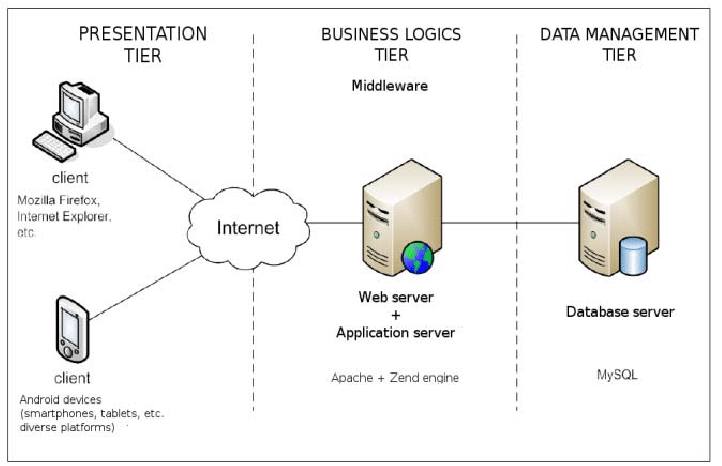
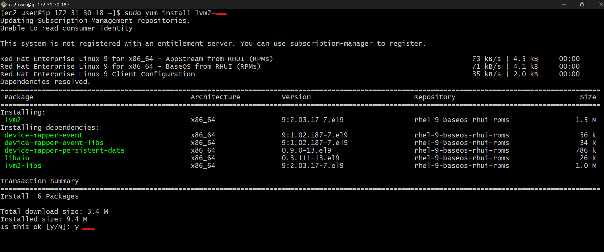
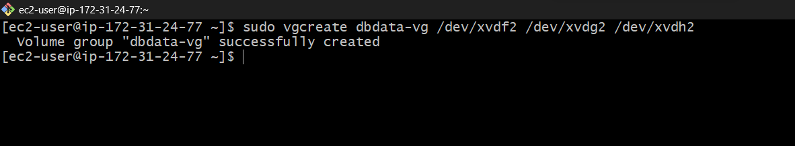
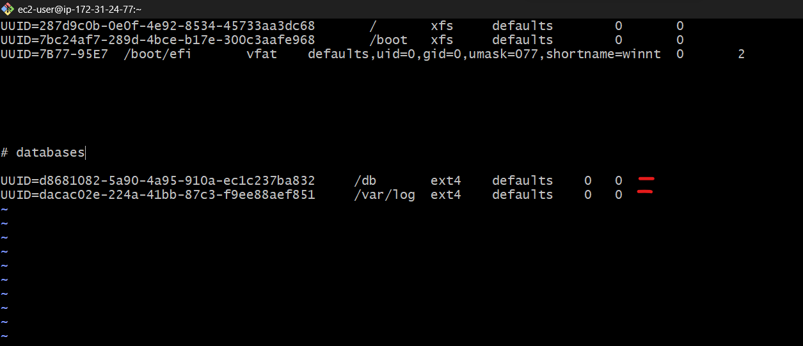
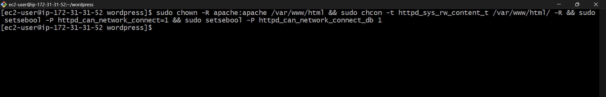
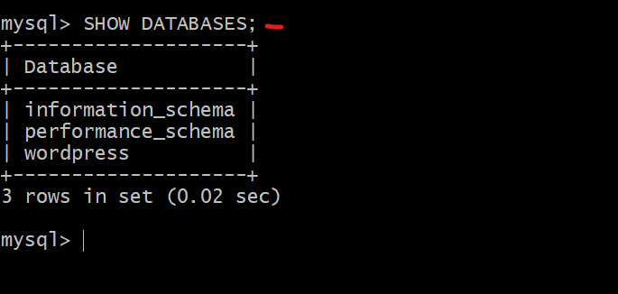

# Web-Solution-With-Wordpress
Implementing Wordpress website with LVM Storage management

## Implementation of a basic web solution using wordpress

WordPress is a content management system (CMS) that allows you to host and build websites. WordPress contains __plugin architecture__ and a __template system__, so you can customize any website to fit your business, blog, portfolio, or online store.

 We are going to prepare storage infrastructure on two Linux servers and implement a basic web solution using WordPress. 
 
 WordPress is a free and open-source content management system written in PHP and paired with MySQL or MariaDB as its backend Relational Database Management System (RDBMS).

 This project consists of two parts:

 * Configure storage subsystem for Web and Database servers based on Linux OS.

 * Install WordPress and connect it to a remote MySQL database server.

  ## Three-tier Architecture

  Three-tier Architecture is a client-server software architecture pattern that comprise of 3 separate layers. They are:

__The 3 tier__

* __Presentation tier__

* __Logic or Application tier__

* __Data tier__

__The 3 layers__

* __Presentation Layer (PL):__ This is the user interface such as the client server or browser on your laptop.

* __Business Layer (BL):__ This is the backend program that implements business logic. Application or Webserver

* __Data Access or Management Layer (DAL):__ This is the layer for computer data storage and data access. Database Server or File System Server such as FTP server, or NFS Server.

Requirements:

Also ensure that the disks used to store files on the Linux servers are adequately partitioned and managed through programs such as `gdisk` and `LVM` respectively.

Your 3-Tier Setup

* A Laptop or PC to serve as a client

* An EC2 Linux Server as a web server (This is where you will install WordPress)

* An EC2 Linux server as a database (DB) server

__Note:__ We are using `RedHat` OS for this project. When connecting to RedHat you will need to use `ec2-user`. Connection string will look like `ec2-user@public-ip-address`.

Results:

## Creating and mounting Volumes

__Steps: Prepare a web server__

1. Launch an EC2 instance that will server as "Web Server". Create 3 volumes in the same AZ as your web server EC2, each of 10 GiB. 

Learn How to Add EBS Volume to an EC2 instance [here](https://www.youtube.com/watch?v=HPXnXkBzIHw)

Results:

2. Attach all three volumes one by one to your EC2 instance.

Results:

3. Connect to your linux server and check what block devices are attached using this command: `$ lsblk`

Notice names of your newly created devices. All devices in linux resides in /dev/directory. Inspect it with `$ ls /dev/` and make sure you see all 3 newly created block devices there - their names will likely be `xvdf` , `xvdg` , `xvdh` .

Results:

4. Use `$ df -h` command to see all mounts and free space on your server.

Results:

5. Use gdisk utility to create a single partition on each of the 3 disks.

__"gdisk"__ is used to create or manage GPT. (GUID partition table).

__"/dev/xvdf, /dev/xvdg, /dev/xvdh"__ this is the path to the specific device you want to manage with gdisk.

`$ sudo gdisk /dev/xvdf`

Type "`?`" command for help to view the options.

Type "`n`" command to add a new partition.

Enter "`p`" command to print the new partition table.

Then use the "`w`" command and enter "`y`" to write table to disk.

Also repeat the same for the other two disks: `$ sudo gdisk /dev/xvdg` , `$ sudo gdisk /dev/xvdh` .

Result for disk 1:

`$ sudo gdisk /dev/xvdg`

Result for disk 2:

`$ sudo gdisk /dev/xvdh`

Result for disk 3:

5. Use lsblk utility to view the newly configured partition on each of the 3 disks.

__"lsblk"__ is used to list information about block devices ans their current status (such as hard drives and partitions) on a linux system

`$ sudo lsblk`

__NAME__: The device name.

__MAJ:MIN__: The major and minor device numbers.

__RM__: whether the device is removable (0 for no, 1 for yes).

__SIZE__: The size of thr device.

__RO__: whether the device is read-only (0 for no, 1 for yes)

__TYPE__: The type of device (eg. disk, part or partition).

__MOUNTPOINT__: The mountpoint, if the device is mounted.

6. Install lvm2 package using `$ sudo yum install lvm2`.

__LVM2__: is a system utility that provides tools and libraries for managing logical volumes, volume groups and physical volumes on linux system.

Results:

 Then Run `$ sudo lvmdiskscan` command to check for available partitions.

 Results:

 

7. Use pvcreate utility to mark each of 3 disks as physical volumes (PVs) to be used by LVM.

__pvcreate__: it is used to create physical volumes (pvs) in the context of logical volume management (lvm) on a linux system. Physical volumes are the first set in setting up LVM and they are used to manage storage devices like hard drives or partitions.

`$ sudo pvcreate /dev/xvdf1`

`$ sudo pvcreate /dev/xvdg1`

`$ sudo pvcreate /dev/xvdh1`

Results:

8. Verify that the physical volume has been created successfully by running this command:

`$ sudo pvs`

Results:

9. Use vgcreate utility to add all 3 PVs to a volume group (VG). Name the VG __webdata-vg__. Means you are creating a volume group named "webdata-vg" and adding 3 physical volumes to it.

`$ sudo vgcreate webdata-vg /dev/xvf1 /dev/xvdg1 /dev/xvdh1`

__"vgcreate"__: Is used to create a new volume group.

__"webdata-vg"__: This is the name you've chosen for the new volume group. You can replace "webdata-vg" with any name of your choice.

__"/dev/xvdf1, /dev/xvdg1, /dev/xvdh1"__: These are the physical volumes that will be added to the "webdata-vg" volume group. In LVM, pvs are actal storage devices, such as hard drives or partitions.

Results:

10. Verify that your VG has been created successfully by running: `$ sudo vgs`

Results:

11. Use lvcreate utility to create 2 logical volumes. __apps-lv__ (Use half of the PV size), and __logs-lv__ Use the remaining space of the PV size.

 __NOTE:__ __apps-lv__ will be used to store data for the Website while, __logs-lv__ will be used to store data for logs.

`$ sudo lvcreate -n apps-lv -L 14G webdata-vg`

`$ sudo lvcreate -n logs-lv -L 14G webdata-vg`

__"lvcreate"__: Is used to create a logical volume.

__"-n apps-lv"__: specifies the name of the logical volumes you want to create , which is "apps-lv" in this case.

__"-L 14G"__: specifies the size of the logical volume in this case, 14gigabytes.

__"webdata-vg"__: specifies the volume group ("webdata-vg") in which you want to create the logical volume.

__"-n logs-lv"__: create a logical volume named "logs-lv".

Results:

12. Verify that your logical volume has been created successfully by running: `$ sudo lvs`

Results:

13. Verify the entire set up: 

`$ sudo vgdisplay -v #view complete setup - VG, PV, and LV`

__"sudo vgdisplay -v"__: command is used to display a comprehensive view of the setup of a volume group (VG) in Logical Volume Management (LVM). This command will provide detailed information about the volume group, its physical volumes (PVs), and logical volumes (LVs).

The output will provide a detailed overview of the volume group, including its name, size, physical volumes, and logical volumes, allowing you to see the complete setup of the VG, PV, and LV.

Results:

`$ sudo lsblk`

Results:

14. Use mkfs.ext4 to format the logical volumes with ext4 filesystem.

`$ sudo mkfs -t ext4 /dev/webdata-vg/apps-lv`

 This command formats the logical volume /dev/webdata-vg/apps-lv with the ext4 file system. It's creating a file system specifically for the "apps" data on this volume.

 

 `$ sudo mkfs -t ext4 /dev/webdata-vg/logs-lv`

 This command formats the logical volume /dev/webdata-vg/logs-lv with the ext4 file system. It's creating a file system specifically for the "logs" data on this volume.

 Results:

15. Create __/var/www/html__ directory to store website files.

`sudo mkdir -p /var/www/html`

Results:

16. Create __/home/recovery/logs__ to store backup of log data

`sudo mkdir -p /home/recovery/logs`

Results:

17. Mount __/var/www/html__ on apps-lv logical volume

`sudo mount /dev/webdata-vg/apps-lv /var/www/html/`

Results:

18. Use `rsync` utility to backup all the files in the log directory __/var/log__ into __/home/recovery/logs__ (This is required before mounting the file system)

`sudo rsync -av /var/log/. /home/recovery/logs/`
Results:

19. Mount __/var/log__ on __logs-lv__ logical volume. (Note that all the existing data on /var/log will be deleted. That is why step of creating /var/www/html directory to store website files).

`sudo mount /dev/webdata-vg/logs-lv /var/log`

Results:

20. Restore log files back into /var/log directory

`$ sudo rsync -av /home/recovery/logs/. /var/log`

Results:

21. Update `/etc/fstab` file so that the mount configuration will persist after restart of the server.

The UUID of the device will be used to update the `/etc/fstab` file.

`sudo blkid`

22. Update /etc/fstab in this format using your own UUID and rememeber to remove the leading and ending quotes.

`sudo vi /etc/fstab`

And add this:

UUID=__uuid of your webdata-vg-apps__ /var/www/html ext4 defaults 0 0

UUID=__uuid of your webdata-vg-logs__ /var/log ext4 defaults 0 0

Results:

22. Test the configuration and reload the daemon

`sudo mount -a`

`sudo systemctl daemon-reload`

23. Verify your setup by running `df -h`, output must look like this:

Results:

## Installing wordpress and configuring to use MySQL Database

__step 2__: Preparing the Database Server

Launch a second RedHat EC2 instance that will have a role – "DB Server"
Repeat the same steps as for the Web Server, but instead of `apps-lv` create `db-lv` and mount it to `/db` directory instead of `/var/www/html/`.

Result:

ssh into the instance you just created:

Result:

Create and attach 3 Logical Volumes to the database server instance.

Result:

Connect to your linux server and check if the volume is attached using this command:

`sudo lsblk`

Result:

Use df -h command to see all mounts and free space on your server

`sudo df -h`

Result:

Using gdisk utility create a single partition on each of the 3 disks.

And then create a new partition with the "n" command, inputting 2 (to create a partition) then "p" to display the new partition table and  then the "w" command to write table to disk and enter "y" to proceed.

`sudo gdisk /dev/xvdf`

Result:

`sudo gdisk /dev/xvdg`

Result:

`sudo gdisk /dev/xvdh`

Result:

Use lsblk utility to view the newly configured partition on each of the 3 disks.

`sudo lsblk`

Result:

Install lvm2 package using sudo yum install lvm2 -y. Run sudo lvmdiskscan command to check for available partitions.

`sudo yum install lvm2 -y`

Result:

`sudo lvmdiskscan`

Result:

Use pvcreate utility to mark each of 3 disks as physical volumes (PVs) to be used by LVM

`sudo pvcreate /dev/xvdf2 /dev/xvdg2 /dev/xvdh2`

Result:

Verify that your Physical volume has been created successfully by running: `sudo pvs`

Result:

Use vgcreate utility to add all 3 PVs to a volume group (VG). Name the VG __"dbdata-vg"__

`sudo vgcreate dbdata-vg /dev/xvdf2 /dev/xvdg2 /dev/xvdh2`

Result:

Use lvcreate utility to create 2 logical volumes. db-lv (Use half of the PV size), and logs-lv Use the remaining space of the PV size. 

NOTE: db-lv will be used to store data for the Website while, logs-lv will be used to store data for logs.

`sudo lvcreate -n db-lv -L 14G dbdata-vg`

`sudo lvcreate -n logs-lv -L 14G dbdata-vg`

Result:

Verify that your Logical Volume has been created successfully by running: `sudo lvs`

Result:

We need to verify all we have done so far on the database server instance so far with these commands.

`sudo vgdisplay -v #view complete setup - VG, PV, and LV`

Results:

`sudo lsblk `

Use mkfs.ext4 to format the logical volumes with ext4 filesystem.

`sudo mkfs.ext4 /dev/dbdata-vg/db-lv && sudo mkfs.ext4 /dev/dbdata-vg/logs-lv`

Result:

Now that we are done configuring the database logical volumes, we would be moving on with creating the mount points for the logical volumes and the required directories.

Create /db directory to store website files.

`sudo mkdir -p /db`

Result:

Create /home/recovery/logs to store backup of log data

`sudo mkdir -p /home/recovery/logs`

Result:

Mount /db on db-lv logical volume

`sudo mount /dev/dbdata-vg/db-lv /db`

Result:

Like we did for the webserver instance use rsync utility to backup all the files in the log directory /var/log into /home/recovery/logs (This is required before mounting the file system)

`sudo rsync -av /var/log/. /home/recovery/logs/`

Result:

Mount /var/log on logs-lv logical volume. (Note that all the existing data on /var/log will be deleted. That is why step of creating /db directory to store database files)

`sudo mount /dev/dbdata-vg/logs-lv /var/log`

Result:

Restore log files back into /var/log directory

`sudo rsync -av /home/recovery/logs/. /var/log`

Result:

Now we need to update the /etc/fstab file to ensure that the configurations we made is persistent across reboots.

Update /etc/fstab file so that the mount configuration will persist after restart of the server.

The UUID of the device will be used to update the /etc/fstab file;

`sudo blkid`

Result:

Update /etc/fstab in this format using your own UUID and rememeber to remove the leading and ending quotes.

`sudo vi /etc/fstab`

And add this:

UUID=__"uuid of your dbdata-vg-db"__ /var/www/html ext4 defaults 0 0

UUID=__"uuid of your dbdata-vg-logs"__ /var/log ext4 defaults 0 0

Result:

Test the configuration and reload the daemon.

`sudo mount -a`

`sudo systemctl daemon-reload`

Verify your setup by running df -h, output must look like this:

`sudo df -h`

Now your db server is ready to go and make other configurations as required.

## Install WordPress on your Web Server EC2 Instance

__step 3:__ Update the repository

`sudo yum update -y`

Result:

Install wget, Apache and it’s dependencies

`sudo yum -y install wget httpd php php-mysqlnd php-fpm php-json`

Result:

Start the apache service

`sudo systemctl enable httpd`

`sudo systemctl start httpd`

`sudo systemctl status httpd`

Result:

To install PHP and it’s depemdencies

`sudo yum install https://dl.fedoraproject.org/pub/epel/epel-release-latest-8.noarch.rpm`

`sudo yum install yum-utils http://rpms.remirepo.net/enterprise/remi-release-8.rpm`

`sudo yum module list php`

`sudo yum module reset php`

`sudo yum module enable php:remi-7.4`

`sudo yum install php php-opcache php-gd php-curl php-mysqlnd`

`sudo systemctl start php-fpm`

`sudo systemctl enable php-fpm`

`setsebool -P httpd_execmem 1`

Result:

Restart Apache

`sudo systemctl restart httpd`

`sudo systemctl status httpd`

Result:

copy and paste the IP address of the webserver to the browser to see the apache is active and running.

Result:

Download wordpress and copy wordpress to `/var/www/html`

Create directory wordpress and cd into the directory.

`mkdir wordpress`

`cd   wordpress`

Download the wordpress file

`sudo wget` http://wordpress.org/latest.tar.gz

Unzip the file

`sudo tar xzvf latest.tar.gz`

Result:

`sudo rm -rf latest.tar.gz`

Copy __"wordpress/wp-config-sample.php"__ into __"wordpress/wp-config.php"__

__NoTE: wordpress/wp-config.php"__ will be created.

`sudo cp wordpress/wp-config-sample.php wordpress/wp-config.php`

Copy wordpress into "/var/www/html".

Result:

`sudo cp -R wordpress/* /var/www/html/`

`cd /var/www/html`

Result:

Configure SELinux Policies

`sudo chown -R apache:apache /var/www/html/`

`sudo chcon -t httpd_sys_rw_content_t /var/www/html/ -R`

`sudo setsebool -P httpd_can_network_connect=1`

`sudo setsebool -P httpd_can_network_connect_db 1`

Result:

## Install MySQL on your DB Server EC2

Install mysql on the db-server

`sudo yum update`

Result:

`sudo yum install mysql-server`

Result:

We now need to verify that the service is up and running by using `sudo systemctl status mysqld`, if it is not running, restart the service and enable it so it will be running even after reboot:

`sudo systemctl restart mysqld`

`sudo systemctl enable mysqld`

Result:

## Configuring the DB to work with WordPress

On your db-server, We need to create a user for the wordpress server to connect to the database.

`sudo mysql`

`mysql>` CREATE DATABASE wordpress;

`mysql>` CREATE USER 'myuser'@'(Web-Server-Private-IP-Address)' 
IDENTIFIED BY 'mypass';

`mysql>` GRANT ALL ON wordpress.* TO 'myuser'@'(Web-Server-Private-IP-Address)';

`mysql>` FLUSH PRIVILEGES;

`mysql>` SHOW DATABASES;

`mysql>` exit

Result:

## Configure WordPress to connect to remote database.

Here we are to open MySQL port 3306 on DB Server EC2. For extra security, you shall allow access to the DB server ONLY from your Web Server’s IP address, so in the Inbound Rule configuration specify source as /32.

Result:

open port 3306 on your db-server and input your webserver private ip address/32 on the source.

Go to your webserver and install MySQL client and test that you can connect from your Web Server to your DB server by using mysql-client

`sudo yum install mysql`

Result:

Create login to the database on the db server

`sudo mysql -u <user> -p -h <DB-Server-Private-IP-address>`

Note that, it's the name of the user and password you created in mysql server on the db server.

`sudo mysql -u ogechukwu -p -h 172.31.6.33`

password:Ogechukwu@1

Result:

Verify if you can successfully execute SHOW DATABASES; command and see a list of existing databases.

Result:

## Change permissions and configuration so Apache could use WordPress:

Here we need to create a configuration file for wordpress in order to point client requests to the wordpress directory.

`sudo vi /etc/httpd/conf.d/wordpress.conf`

Result:

And copy and paste the lines below:

The ip address is the private ip of your db-server.

`<VirtualHost *:80>`

`ServerAdmin ogechukwu@172.31.6.33`

`DocumentRoot /var/www/html/wordpress`

`<Directory "/var/www/html/wordpress">`

`Options Indexes FollowSymLinks`

`AllowOverride all`

`Require all granted`

`</Directory>`

`ErrorLog /var/log/httpd/wordpress_error.log`

`CustomLog /var/log/httpd/wordpress_access.log common`

`</VirtualHost>`

Result:

To apply the changes, restart Apache.

`sudo systemctl restart httpd`

Result:

Edit the wp-config file.

`sudo vi /var/www/html/wordpress/wp-config.php`

Result:

And add the following:

`define('DB_NAME', 'wordpress');`

`define('DB_USER', 'ogechukwu');`

`define('DB_PASSWORD', 'Ogechukwu@1');`

`define('DB_HOST 'db-Server-Private-IP-Address');`

`define('DB_CHARSET', 'utf8');`

`define('DB_COLLATE', '');`

Result:

Go to you webserver and Enable TCP port 80 in Inbound Rules configuration for your Web Server EC2 (enable from everywhere 0.0.0.0/0 or from your workstation’s IP)

Result:

Try to access from your browser the link to your WordPress.

`http://<Web-Server-Public-IP-Address>/wordpress/`

paste your public ip address of your webserver on your browser.

Result:

_choose your language_

_fill the information_

_log in your credentials_

_finally your wordpress has successfully connected to your remote MySQL database_ 

